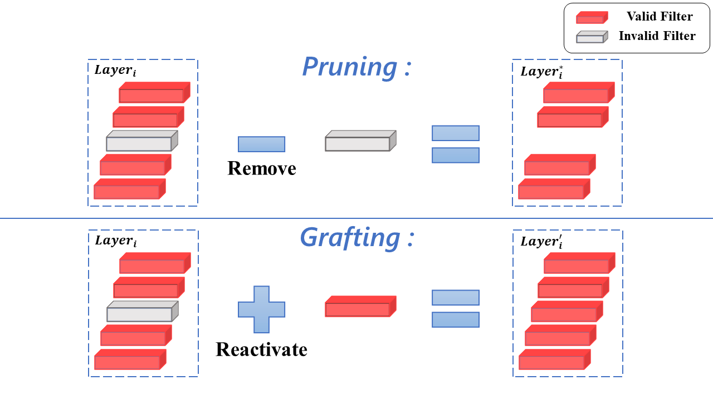

# Filter Grafting for Deep Neural Networks
## Introduction

This is the PyTorch implementation of our CVPR 2020 paper "[Filter Grafting for Deep Neural Networks](https://arxiv.org/abs/2001.05868)". 

Invalid filters limit the potential of DNNs since they are identified as having little effect on the network. While filter pruning removes these invalid filters for efficiency consideration, Filter Grafting **re-activates** them from an accuracy boosting perspective. The activation is processed by grafting external information (weights) into invalid filters. 



## Prerequisites
Python 3.6+

PyTorch 1.0+

## CIFAR dataset

```
grafting.py [-h] [--lr LR] [--epochs EPOCHS] [--device DEVICE]
                   [--data DATA] [--s S] [--model MODEL] [--cifar CIFAR]
                   [--print_frequence PRINT_FREQUENCE] [--a A] [--c C]
                   [--num NUM] [--i I] [--cos] [--difflr]
PyTorch Grafting Training
optional arguments:
  -h, --help            show this help message and exit
  --lr LR               learning rate
  --epochs EPOCHS       total epochs for training
  --device DEVICE       cuda or cpu
  --data DATA           dataset path
  --s S                 checkpoint save path
  --model MODEL         Network used
  --cifar CIFAR         cifar10 or cifar100 dataset
  --print_frequence PRINT_FREQUENCE
                        test accuracy print frequency
  --a A                 hyperparameter a for calculate weighted average
                        coefficient
  --c C                 hyper parameter c for calculate weighted average
                        coefficient
  --num NUM             Number of Networks used for grafting
  --i I                 This program is the i th Network of all Networks
  --cos                 Use cosine annealing learning rate
  --difflr              Use different initial learning rate
```

### Execute example

#### Simply run
shell
```
cd grafting_cifar
./grafting.sh
```

or 

#### Two models grafting

```shell
CUDA_VISIBLE_DEVICES=0 nohup python grafting.py --s checkpoint/grafting_cifar10_resnet32 --cifar 10  --model resnet32 --num 2 --i 1 >checkpoint/grafting_cifar10_resnet32/1.log &
CUDA_VISIBLE_DEVICES=1 nohup python grafting.py --s checkpoint/grafting_cifar10_resnet32 --cifar 10  --model resnet32 --num 2 --i 2  >checkpoint/grafting_cifar10_resnet32/2.log &
```

#### Three models grafting

```shell
CUDA_VISIBLE_DEVICES=0 nohup python grafting.py --s checkpoint/grafting_cifar10_resnet32 --cifar 10  --model resnet32 --num 3 --i 1 >checkpoint/grafting_cifar10_resnet32/1.log &
CUDA_VISIBLE_DEVICES=1 nohup python grafting.py --s checkpoint/grafting_cifar10_resnet32 --cifar 10  --model resnet32 --num 3 --i 2 >checkpoint/grafting_cifar10_resnet32/2.log &
CUDA_VISIBLE_DEVICES=2 nohup python grafting.py --s checkpoint/grafting_cifar10_resnet32 --cifar 10  --model resnet32 --num 3 --i 3 >checkpoint/grafting_cifar10_resnet32/3.log &
```

## Results

| model       | method          | cifar10   | cifar100  |
| ----------- | --------------- | --------- | --------- |
|  ResNet32   | baseline        | 92.83     | 69.82     |
|             | grafting(slr)   | 93.33     | 71.16     |
|             | grafting(dlr)   | **93.94** | **71.28** |
|  ResNet56   | baseline        | 93.50     | 71.55     |
|             | grafting(slr)   | 94.28     | **73.09** |
|             | grafting(dlr)   | **94.73** | 72.83     |
| ResNet110   | baseline        | 93.81     | 73.21     |
|             | grafting(slr)   | 94.60     | 74.70     |
|             | grafting(dlr)   | **94.96** | **75.27** |
| MobileNetv2 | baseline        | 92.42     | 71.44     |
|             | grafting(slr)   | 93.53     | 73.26     |
|             | grafting(dlr)   | **94.20** | **74.15** |

Grafting(slr) use the same learning rate with baseline that initial learning rate 0.1, and decay 0.1 at every 60 epochs.

While grafting(dlr) set different initial learning rate to increase two models' diversity, and use cosine annealing learning rate to make each batch of data have different importance to further increase the diversity.

| MobileNetV2       | CIFAR-10  | CIFAR-100 |
| ----------------- | --------- | --------- |
| baseline          | 92.42     | 71.44     |
| 6 models ensemble | 94.09     | 76.75     |
| 2 models grafting | 94.20     | 74.15     |
| 3 models grafting | 94.55     | 76.21     |
| 4 models grafting | 95.23     | 77.08     |
| 6 models grafting | **95.33** | **78.32** |
| 8 models grafting | 95.20     | 77.76     |

Comparison of the number of invalid filters
| model       | threshold | baseline(invlid/total) | grafting(invlid/total) |
| ----------- | --------- | ---------------------- | ---------------------- |
| ResNet32    | 0.1       | 36/1136                | 14/1136                |
|             | 0.01      | 35/1136                | 8/1136                 |
| MobileNetV2 | 0.1       | 10929/17088            | 9903/17088             |
|             | 0.01      | 9834/17088             | 8492/17088             |

The relu function will generates a large number of convolution kernels with a gradient of 0. Activation functions like leaky relu will not have kernels with gradients that are always 0. However, invalid filters are still generated that still do not contribute to the model. Grafting also works for models using leaky_relu activation functions.
| model                  | method   | cifar10 | cifar100 |
| ---------------------- | -------- | ------- | -------- |
| resnet32_leaky_relu    | baseline | 93.28   | 70.04    |
|                        | grafting | 93.6    | 70.93    |
| resnet32_leaky_relu    | baseline | 94.03   | 72.24    |
|                        | grafting | 94.32   | 73.14    |
| resnet32_leaky_relu    | baseline | 93.24   | 73.34    |
|                        | grafting | 93.97   | 73.82    |

Filter level grafting

| model    |  method  |  level  |   cifar10    |  cifar100  |
| ---------| -------- | ------- |   --------   |  --------  |
| VGG16    | baseline |  ---    |    93.68     |   73.41    |
|          | grafting |  layer  |    94.02     |   74.28    |
|          | grafting |  filter |  **94.26**   | **74.63**  |

Discusse the two hyper-pameters A and c

| MoblieNetV2 | A    | c    | cifar10 | cifar100 |
| ----------- | ---- | ---- | ------- | -------- |
| baseline    | ---  | ---  | 92.42   | 71.44    |
|             |      | 1    | 93.19   | 73.3     |
|             |      | 5    | 92.76   | 72.69    |
|             | 0.4  | 10   | 93.31   | 73.26    |
|             |      | 50   | 93.24   | 73.05    |
|             |      | 500  | 92.79   | 72.38    |
| grafting    | 0    |      | 93.4    | 72.55    |
|             | 0.2  |      | 93.61   | 72.9     |
|             | 0.4  | 100  | 93.46   | 73.13    |
|             | 0.6  |      | 92.6    | 72.68    |
|             | 0.8  |      | 93.03   | 71.8     |
|             | 1    |      | 92.53   | 72.27    |

## ImageNet dataset

### usage

```
grafting.py [-h] [--data DIR] [-a ARCH] [-j N] [--epochs N]
                   [--start-epoch N] [-b N] [--lr LR] [--momentum M] [--wd W]
                   [-p N] [--resume RESUME] [-e] [--pretrained] [--gpu GPU]
                   [--s S] [--num NUM] [--i I] [--a A] [--c C]
PyTorch ImageNet Training
optional arguments:
  -h, --help            show this help message and exit
  --data DIR            path to dataset
  -a ARCH, --arch ARCH  model architecture: alexnet | densenet121 |
                        densenet161 | densenet169 | densenet201 | inception_v3
                        | resnet101 | resnet152 | resnet18 | resnet34 |
                        resnet50 | squeezenet1_0 | squeezenet1_1 | vgg11 |
                        vgg11_bn | vgg13 | vgg13_bn | vgg16 | vgg16_bn | vgg19
                        | vgg19_bn (default: resnet18)
  -j N, --workers N     number of data loading workers (default: 4)
  --epochs N            number of total epochs to run
  --start-epoch N       manual epoch number (useful on restarts)
  -b N, --batch-size N  mini-batch size (default: 256), this is the total
                        batch size of all GPUs on the current node when using
                        Data Parallel or Distributed Data Parallel
  --lr LR, --learning-rate LR
                        initial learning rate
  --momentum M          momentum
  --wd W, --weight-decay W
                        weight decay (default: 1e-4)
  -p N, --print-freq N  print frequency (default: 10)
  --resume RESUME       path to latest checkpoint (default: none)
  -e, --evaluate        evaluate model on validation set
  --pretrained          use pre-trained model
  --gpu GPU             GPU id to use.
  --s S                 checkpoint save dir
  --num NUM             number of Networks in grafting
  --i I                 the i-th program
  --a A                 hyperparameter a for calculate weighted average
                        coefficient
  --c C                 hyper parameter c for calculate weighted average
                        coefficient
```


### Execute example

#### Simply run

```shell
cd grafting_imagenet
./grafting.sh
```

or

#### Two models grafting

```shell
CUDA_VISIBLE_DEVICES=0 nohup python grafting.py --arch resnet18 --s grafting_imagenet_resnet18 --num 2 --i 1 >checkpoint/grafting_imagenet_resnet18/1.out &
CUDA_VISIBLE_DEVICES=1 nohup python grafting.py --arch resnet18 --s grafting_imagenet_resnet18 --num 2 --i 2 >checkpoint/grafting_imagenet_resnet18/2.out &
```


#### Three models grafting

```shell
CUDA_VISIBLE_DEVICES=0 nohup python grafting.py --arch resnet18 --s grafting_imagenet_resnet18 --num 3 --i 1 >checkpoint/grafting_imagenet_resnet18/1.out &
CUDA_VISIBLE_DEVICES=1 nohup python grafting.py --arch resnet18 --s grafting_imagenet_resnet18 --num 3 --i 2 >checkpoint/grafting_imagenet_resnet18/2.out &
CUDA_VISIBLE_DEVICES=2 nohup python grafting.py --arch resnet18 --s grafting_imagenet_resnet18 --num 3 --i 3 >checkpoint/grafting_imagenet_resnet18/3.out &
```

## Results

| model    | method   | top 1     | top 5     |
| -------- | -------- | --------- | --------- |
| ResNet18 | baseline | 69.15     | 88.87     |
|          | grafting | **71.19** | **90.01** |
| ResNet34 | baseline | 72.60     | 90.91     |
|          | grafting | **74.58** | **92.05** |
| ResNet50 | baseline | 75.92     | 92.81     |
|          | grafting | **76.76** | **93.34** |

##  Citation

If you find this code useful, please cite the following paper:

```
@InProceedings{Meng_2020_CVPR,
author = {Meng, Fanxu and Cheng, Hao and Li, Ke and Xu, Zhixin and Ji, Rongrong and Sun, Xing and Lu, Guangming},
title = {Filter Grafting for Deep Neural Networks},
booktitle = {The IEEE/CVF Conference on Computer Vision and Pattern Recognition (CVPR)},
month = {June},
year = {2020}
}
```

## References
For CIFAR, our code is based on https://github.com/kuangliu/pytorch-cifar.git

For ImageNet, our code is based on https://github.com/pytorch/examples/tree/master/imagenet 
